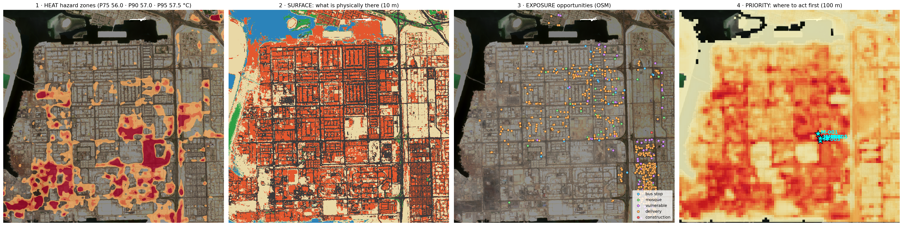

# QAYDH (القيظ) — heat-risk intelligence for Gulf cities

**Arab Youth Space Hackathon 2026 · Challenge 813 · Team T0049 (UAE)**
**Theme 2 · Urban Expansion, Land Use Change & Heat Risk**

> We don't only map heat. We explain it, material by material, and say what to do first.
> نحن لا نكتفي برسم خريطة للحرارة؛ بل نفسر أسبابها على مستوى المواد ونقترح التدخل المناسب.

| ▶ Live dashboard | 📊 Pitch | 💻 Notebook |
|---|---|---|
| [noora-alhajeri.github.io/QAYDH-813-T0049](https://noora-alhajeri.github.io/QAYDH-813-T0049/) · [backup link](https://raw.githack.com/Noora-Alhajeri/QAYDH-813-T0049/main/dashboard/index.html) | [PDF](pitch/QAYDH_T0049_pitch.pdf) · [PPTX with demo GIFs](pitch/QAYDH_T0049_pitch.pptx) | [`QAYDH_T0049_urban_heat_risk.ipynb`](QAYDH_T0049_urban_heat_risk.ipynb), executed end to end, all outputs visible |


---

## 1 · The problem

Gulf cities grow fast and their surfaces pass **55 °C** in summer. People still walk to Dhuhr and Asr prayers, wait at bus stops, deliver food and build outdoors **11:00–20:00**, the hours above 40 °C on most summer days. Heat maps already exist, but they only say *where* it is hot. Planners still decide shade, cool roofs and trees case by case, because no map says **why** a place is hot, **who** is outside, or **what fix** matches the surface.

## 2 · What QAYDH does

For every hotspot, QAYDH answers five questions:

| Step | Question | How | Output |
|---|---|---|---|
| 1 | **Where** is heat high? | Landsat 8/9 thermal, 3 summers, hazard zones (top 5% = extreme); ERA5 danger hours checked against NOAA stations | Heat hazard map |
| 2 | **Who** may be exposed? | WorldPop residents + named OpenStreetMap bus stops, mosques, schools, clinics, labour camps, industrial land | Exposure sites with names and icons |
| 3 | **What** is physically there? | Sentinel-2 10 m surfaces + **Planet Tanager / NASA EMIT hyperspectral** materials + 25,462 labelled building objects | Material map |
| 4 | **Why** may it be hot? | Spatially validated driver model linking surfaces to heat | Drivers per hotspot |
| 5 | **What** should be done? | Expert material → fix catalogue (Estidama cool-roof SRI, MoHRE midday break, shade standards) + Llama-3.3-70B brief, fact-checked | Ranked plan per hotspot (M-001 = Musaffah hotspot #1) |

**Example, hotspot M-001 (Al Hayal Street, Musaffah):** hotter than 93% of Musaffah (57.2 °C surface) · 54% asphalt, 44% bare sand, 0% greenery · industrial outdoor workers and pedestrians · **Do now:** shaded rest node + water station and the MoHRE midday break; cool-pavement coating on the asphalt; elastomeric coating on concrete roofs; shade sails and Ghaf trees on the sand.

## 3 · What is new

- **Material-aware:** each hotspot's fix depends on what it is made of. Metal roof, concrete roof, asphalt and bare sand each get a different treatment.
- **People-aware:** counting people instead of buildings changes **90%** of the top-20 priorities.
- **Desert-proof:** the starter NDBI rule calls bare sand "city" (it labels 92% of Musaffah built-up). QAYDH fixes this with hyperspectral, radar and trained models.
- **Hyperspectral in two cities:** Planet **Tanager** (426 bands) over Riyadh and NASA **EMIT** (285 bands) over Musaffah, Abu Dhabi. The same pipeline takes **Satellite 813**.
- **Trustworthy AI:** SAM segments objects; Llama-3.3-70B writes planner briefs only from verified facts, and every number is fact-checked.

## 4 · Evidence (every claim checked on data the model never saw)

| Claim | Checked against | QAYDH | Baseline |
|---|---|---|---|
| Musaffah surfaces (road · roof · sand · green · water) | Held-out 1 km blocks | **F1 0.91** | starter index rules 0.47 |
| Built-up map, Riyadh | Spatial-block CV vs ESA WorldCover | **F1 0.89** | NDBI rule 0.58 |
| Same map, another year and source | Impact Observatory 2023 | **F1 0.86** | 0.58 |
| Built-up with Sentinel-1 radar | Held-out blocks | **F1 0.89** | optical only 0.85 |
| Heat drivers, Musaffah | Landsat LST, unseen blocks | **R² 0.85**, MAE 1.2 °C | NDBI alone r 0.40 |
| Hyperspectral adds value (Tanager, Riyadh) | Spatial CV with/without | **+0.13 R²** (built-up) | — |
| Weather and danger hours (air temperature) | ERA5 vs 3 NOAA stations (Al Bateen, Abu Dhabi Intl, Riyadh), **hourly, ≈2,000 h per station**, summer 2025 | **r 0.95–0.99**, MAE 1.4–1.5 °C | — |
| Surface vs air (descriptive, not a validation) | Landsat LST minus station air at overpass, 10–22 Landsat days per station | surface–air difference **+10.7 to +15.5 °C** | LST is a different physical quantity from air temperature, so this is reported as a difference, not a bias, and is not used to validate absolute LST |
| Hotspots are stable | Same cells 2024 vs 2025 | **r 0.90** | — |
| Priorities are robust | 4 alternative weightings | 60–100% top-20 overlap | — |
| Cool roofs cool | Block-bootstrap regression | **−0.70 °C per +0.10 albedo** (95% CI −0.85 to −0.56) | — |
| Planner briefs | Number-by-number fact-check | **5/5 pass** (Llama-3.3-70B) | — |
| **Independent accuracy check (people on the ground imagery)** | 60 simple-random points, Musaffah; 20 labelled by all three of us (inter-rater κ), 40 by one; `validation/score_independent.py` | *filled in by the script once labelled* | majority-class baseline reported beside it |

All numbers above except the last row are agreement with reference maps the model learned from or was tuned against. The independent check is the one number measured against people looking at very-high-resolution imagery, so we expect it to be lower than 0.91 and report it as it comes out.

### Example output

The notebook writes all of these into `qaydh_outputs/` (committed). Three of them:




## 5 · How the labels were built

- **Reference labels:** OSM roads, Microsoft + OSM building outlines, ESA WorldCover. A 10 m pixel is labelled only if one class covers **≥ 80%** of it; mixed pixels are excluded.
- **Cleaning:** confident learning removed 1,718 noisy labels.
- **Fair test:** 1 km blocks A–C train, D validates, E is the held-out test.
- **Objects:** 25,462 buildings with ID, outline, box, roof class, heat zone, street; 445 cool-roof candidates.
- **AI segments:** SAM (Segment Anything) gives 84 segments around hotspots, 72 clean enough to become labels.
- **Named places:** 139 sites with real names (Arabic where available) and icons.
- **Roof materials:** 139 roofs labelled visually on ~0.3 m imagery, blind to the model.

## 6 · How users get it

1. **Story dashboard:** six guided steps, hotspot and site cards, layers for heat, surfaces, confidence, buildings, objects, sites, SAM segments and priority. To be hosted on Space42 **gIQ**.
2. **GeoJSON / REST API:** 100 m and 300 m decision cells for ArcGIS, QGIS and permitting (`qaydh_outputs/*.geojson`).
3. **Heat alerts and summer report:** danger-hour alerts per hotspot and a one-page planner brief.

**Who benefits:** municipalities and planners, transport authorities (bus shelters), developers, delivery and mobility platforms (rider cooling points), research centres and universities, space and EO programmes.

## 7 · Data (open, no credentials stored, no raw imagery committed)

Planet Tanager (CC-BY-4.0) · NASA EMIT · Landsat 8/9 (USGS) · Sentinel-1 and Sentinel-2 (ESA Copernicus) · ESA WorldCover · Impact Observatory LULC · Microsoft Building Footprints (ODbL) · OpenStreetMap (ODbL) · WorldPop 2025 · ERA5 via Open-Meteo · NOAA ISD stations. Every scene ID is in [`qaydh_outputs/data_provenance.json`](qaydh_outputs/data_provenance.json).

## 8 · Run it

**Fresh Google Colab (what a reviewer does):**
```
!git clone https://github.com/Noora-Alhajeri/QAYDH-813-T0049.git
%cd QAYDH-813-T0049
!pip install -r requirements.txt
```
then *Runtime → Restart session* → *Run all*. All paths are relative to the repo; every random step uses `SEED = 813`; the exact input scenes are listed in [`example_input/README.md`](example_input/README.md) and the Tanager STAC item is read from `example_input/`.

**Local:**
```bash
python -m venv .venv && source .venv/bin/activate
pip install -r requirements.txt
python -m ipykernel install --user --name qaydh
```
Open the notebook, pick the **qaydh** kernel, **Run All** (≈60 min the first time; downloads are cached in `data/`). Optional: a NASA Earthdata token in `~/.edl_token` (EMIT section) and a Hugging Face token (Llama briefs); without them those sections fall back gracefully.
Rebuild products: `python dashboard/build_dashboard.py` · `python pitch/build_deck.py`

## 9 · Repository

| Path | What |
|---|---|
| `QAYDH_T0049_urban_heat_risk.ipynb` | Full pipeline, executed |
| `dashboard/index.html` | Interactive dashboard (single file) |
| `pitch/` | PDF + PPTX deck, demo GIFs, deck builder |
| `qaydh_outputs/` | All figures, `results.json`, GeoJSON cells, hotspot and site tables, annotation polygons |
| `example_input/` | Example inputs (Tanager STAC item, OSM extract) |

## 10 · Limits and next steps

- Thermal is ~100 m, so we map heat **zones** and the objects inside them, not single-bus-stop temperatures.
- 60 m EMIT pixels mix roofs and roads; Tanager at 30 m separates materials clearly. **Satellite 813** brings the finer detail, which is the incubation goal.
- Incubation: Satellite 813 / MBZ-SAT over Abu Dhabi, Dubai and Al Ain; a municipal pilot in Musaffah; deployment on gIQ.

---
Team T0049: انتصار الحبسي (lead) · نورة الهاجري · مريم البني
