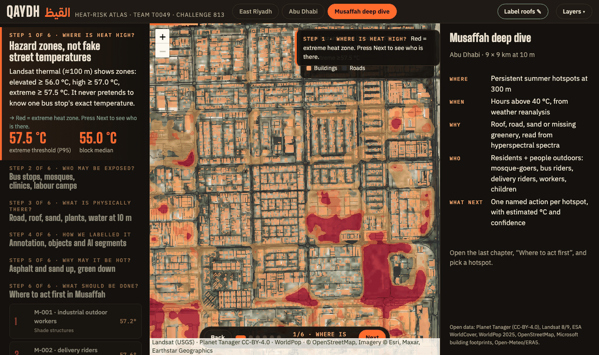
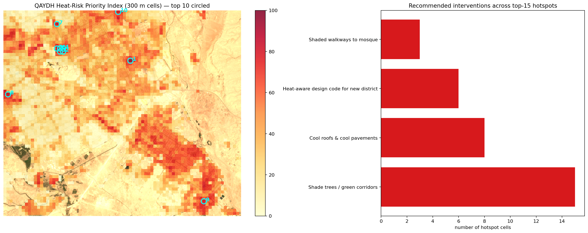
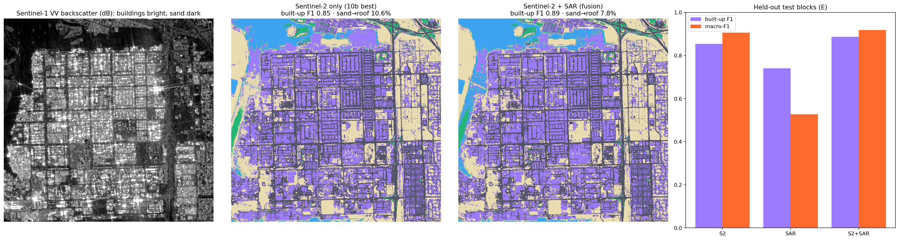

# QAYDH (القيظ) — heat-risk intelligence for Gulf cities

**One line:** QAYDH finds summer heat hotspots in Gulf cities from satellite data, explains each one by its surface materials, shows who is outside there, and ranks the fix to do first.

**Arab Youth Space Hackathon 2026 · Challenge 813 · Team T0049 (UAE)**
**Theme 05 · Urban Expansion, Land Use Change & Heat Risk**

[](https://colab.research.google.com/github/Noora-Alhajeri/QAYDH-813-T0049/blob/main/QAYDH_T0049_urban_heat_risk.ipynb)

> We don't only map heat. We explain it, material by material, and say what to do first.
> نحن لا نكتفي برسم خريطة للحرارة؛ بل نفسر أسبابها على مستوى المواد ونقترح التدخل المناسب.

| ▶ Live dashboard | 📊 Pitch | 💻 Notebook |
|---|---|---|
| [noora-alhajeri.github.io/QAYDH-813-T0049](https://noora-alhajeri.github.io/QAYDH-813-T0049/) · [backup link](https://raw.githack.com/Noora-Alhajeri/QAYDH-813-T0049/main/dashboard/index.html) | [PDF](pitch/QAYDH_T0049_pitch.pdf) · [PPTX with demo GIFs](pitch/QAYDH_T0049_pitch.pptx) | [`QAYDH_T0049_urban_heat_risk.ipynb`](QAYDH_T0049_urban_heat_risk.ipynb), executed end to end, all outputs visible |



---

## 1 · Business use case

- **User:** municipal planners (Abu Dhabi DMT, Riyadh RCRC), transport authorities, developers, delivery platforms.
- **Decision:** where to put shade, cool roofs, cool pavement, trees, water stations and rest nodes first, and which fix suits each surface.
- **What they use today:** generic heat maps that say *where* it is hot, plus site-by-site judgement. No tool says *why* a place is hot, *who* is outside, or *which* fix matches the material.
- **What QAYDH gives:** a ranked list of hotspots, each with its materials, exposed sites and a short action plan, as a dashboard and GeoJSON for ArcGIS/QGIS.

1. **Story dashboard:** six guided steps, hotspot and site cards, layers for heat, surfaces, confidence, buildings, objects, sites, SAM segments and priority. To be hosted on Space42 **gIQ**.
2. **GeoJSON / REST API:** 100 m and 300 m decision cells for ArcGIS, QGIS and permitting (`qaydh_outputs/*.geojson`).
3. **Heat alerts and summer report:** danger-hour alerts per hotspot and a one-page planner brief.

**Who benefits:** municipalities and planners, transport authorities (bus shelters), developers, delivery and mobility platforms (rider cooling points), research centres and universities, space and EO programmes.

## 2 · The problem


Gulf cities grow fast and their surfaces pass **55 °C** in summer. People still walk to Dhuhr and Asr prayers, wait at bus stops, deliver food and build outdoors **11:00–20:00**, the hours above 40 °C on most summer days. Heat maps already exist, but they only say *where* it is hot. Planners still decide shade, cool roofs and trees case by case, because no map says **why** a place is hot, **who** is outside, or **what fix** matches the surface.

**Why satellites:** heat, surfaces and growth must be measured city-wide, every summer, at the same time of day. Only thermal, multispectral, radar and hyperspectral satellites do that.

## 3 · Data used

| Dataset | Provider | Dates | Processing level | Licence |
|---|---|---|---|---|
| Landsat 8/9 TIRS land surface temperature | USGS (Planetary Computer) | summers 2023–2025 (Musaffah: 10 clear scenes 2025-06-01 → 2025-08-28) | Collection 2 Level-2 ST | Public domain |
| Sentinel-2 MSI | ESA Copernicus | summer 2025 | Level-2A | Copernicus open licence |
| Sentinel-1 GRD | ESA Copernicus | summer 2025 | RTC (radiometrically terrain corrected) | Copernicus open licence |
| Planet Tanager hyperspectral (Riyadh) | Planet Labs | 2025 (scene ID in `example_input/`) | Level-2 surface reflectance | Tanager STAC Data, © 2025 Planet Labs PBC |
| NASA EMIT hyperspectral (Musaffah) | NASA LP DAAC | 2024–2025 | L2A reflectance | NASA open data |
| ESA WorldCover | ESA | 2021 | 10 m land cover | CC-BY-4.0 |
| Impact Observatory LULC | Esri / IO | 2023 | 10 m land cover | CC-BY-4.0 |
| Building footprints | Microsoft + OpenStreetMap | 2024–2025 | vector | ODbL |
| Roads, POIs, mosques, bus stops | OpenStreetMap | 2025 | vector | ODbL |
| Population | WorldPop | 2025 | 100 m | CC-BY-4.0 |
| Air temperature | ERA5 (via Open-Meteo), NOAA ISD stations | summer 2025, hourly | reanalysis / station | Copernicus licence / NOAA open |

Every scene ID and date: [`example_input/README.md`](example_input/README.md) and [`qaydh_outputs/data_provenance.json`](qaydh_outputs/data_provenance.json). No raw scenes are committed.

## 4 · Technical approach (in execution order)

For every hotspot, QAYDH answers five questions:

| Step | Question | How | Output |
|---|---|---|---|
| 1 | **Where** is heat high? | Landsat 8/9 thermal, 3 summers, hazard zones (top 5% = extreme); ERA5 danger hours checked against NOAA stations | Heat hazard map |
| 2 | **Who** may be exposed? | WorldPop residents + named OpenStreetMap bus stops, mosques, schools, clinics, labour camps, industrial land | Exposure sites with names and icons |
| 3 | **What** is physically there? | Sentinel-2 10 m surfaces + **Planet Tanager / NASA EMIT hyperspectral** materials + 25,462 labelled building objects | Material map |
| 4 | **Why** may it be hot? | Spatially validated driver model linking surfaces to heat | Drivers per hotspot |
| 5 | **What** should be done? | Expert material → fix catalogue (Estidama cool-roof SRI, MoHRE midday break, shade standards) + Llama-3.3-70B brief, fact-checked | Ranked plan per hotspot (M-001 = Musaffah hotspot #1) |

**Example, hotspot M-001 (Al Hayal Street, Musaffah):** hotter than 93% of Musaffah (57.2 °C surface) · 54% asphalt, 44% bare sand, 0% greenery · industrial outdoor workers and pedestrians · **Do now:** shaded rest node + water station and the MoHRE midday break; cool-pavement coating on the asphalt; elastomeric coating on concrete roofs; shade sails and Ghaf trees on the sand.

- **Reference labels:** OSM roads, Microsoft + OSM building outlines, ESA WorldCover. A 10 m pixel is labelled only if one class covers **≥ 80%** of it; mixed pixels are excluded.
- **Cleaning:** confident learning removed 1,718 noisy labels.
- **Fair test:** 1 km blocks A–C train, D validates, E is the held-out test.
- **Objects:** 25,462 buildings with ID, outline, box, roof class, heat zone, street; 445 cool-roof candidates.
- **AI segments:** SAM (Segment Anything) gives 84 segments around hotspots, 72 clean enough to become labels.
- **Named places:** 139 sites with real names (Arabic where available) and icons.
- **Roof materials:** 139 roofs given AI-assisted visual labels on ~0.3 m imagery (one labeller, not yet human-verified; the team re-labels them with `dashboard/label.html`). Treat roof-material accuracy as provisional.

**What is new**
- **Material-aware:** each hotspot's fix depends on what it is made of. Metal roof, concrete roof, asphalt and bare sand each get a different treatment.
- **People-aware:** counting people instead of buildings changes **90%** of the top-20 priorities.
- **Desert-proof:** the starter NDBI rule calls bare sand "city" (it labels 92% of Musaffah built-up). QAYDH fixes this with hyperspectral, radar and trained models.
- **Hyperspectral in two cities:** Planet **Tanager** (426 bands) over Riyadh and NASA **EMIT** (285 bands) over Musaffah, Abu Dhabi. The same pipeline takes **Satellite 813**.
- **Trustworthy AI:** SAM segments objects; Llama-3.3-70B writes planner briefs only from verified facts, and every number is fact-checked.

**Models and parameters:** Random Forest (scikit-learn), `SEED = 813`; 1 km spatial blocks A–C train, D validate, E test (no buffer between blocks); confident learning on training blocks only; SAM segments used for display only, never as training labels; Llama-3.3-70B briefs written from verified numbers and fact-checked.

## 5 · Installation

**Requires Python 3.11–3.13** (Google Colab uses 3.13). No GPU needed.

**Easiest: Google Colab.** Click the *Open in Colab* badge at the top, or in a new Colab notebook run:
```
!git clone https://github.com/Noora-Alhajeri/QAYDH-813-T0049.git
%cd QAYDH-813-T0049
!pip install -r requirements.txt
```
Then *Runtime → Restart session*.

**Local:**
```bash
git clone https://github.com/Noora-Alhajeri/QAYDH-813-T0049.git
cd QAYDH-813-T0049
python -m venv .venv && source .venv/bin/activate
pip install -r requirements.txt
python -m ipykernel install --user --name qaydh
```

**Optional environment variables / tokens** (nothing is stored in the repo; without them those sections skip gracefully):
- `EARTHDATA_TOKEN` or `~/.edl_token`: NASA Earthdata (EMIT section)
- `HF_TOKEN`: Hugging Face (Llama briefs)

## 6 · How to run

1. Open `QAYDH_T0049_urban_heat_risk.ipynb` (Colab or the **qaydh** kernel).
2. Nothing to edit. The area (Musaffah, bbox `[54.455, 24.315, 54.545, 24.395]`) and `SEED = 813` are set in the first cells.
3. *Run all*. Runtime ≈60 min on the first run (downloads), then cached in `data/`.
4. At the end you see the hotspot priority map, the evidence table, and all products in `qaydh_outputs/`.

All paths are relative to the repo. Rebuild the dashboard and deck (optional): `python dashboard/build_dashboard.py` · `python pitch/build_deck.py`.

## 7 · Example input and output

- **Input:** [`data/sample_input/`](data/sample_input/) (Tanager STAC item, OSM extract, scene list with exact IDs and dates; same as `example_input/`).
- **Output:** [`results/example_output.png`](results/example_output.png), [`results/example_output_hotspots.csv`](results/example_output_hotspots.csv), [`results/example_output_results.json`](results/example_output_results.json).


More outputs:





## 8 · Results and limitations
 

| Claim | Checked against | QAYDH | Baseline |
|---|---|---|---|
| Musaffah surfaces (road · roof · sand · green · water) | Held-out 1 km blocks | **F1 0.91** | starter index rules 0.47 |
| Built-up map, Riyadh | Spatial-block CV vs ESA WorldCover | **F1 0.89** | NDBI rule 0.58 |
| Same map, another year and source | Impact Observatory 2023 | **F1 0.86** | 0.58 |
| Built-up with Sentinel-1 radar | Held-out blocks | **F1 0.89** | optical only 0.85 |
| Heat drivers, Musaffah | Landsat LST, unseen blocks | **R² 0.85**, MAE 1.2 °C | NDBI alone r 0.40 |
| Hyperspectral adds value (Tanager, Riyadh) | Spatial CV with/without | **+0.13 R²** (built-up) | — |
| Weather and danger hours (air temperature) | ERA5 vs 3 NOAA stations (Al Bateen, Abu Dhabi Intl, Riyadh), **hourly, ≈2,000 h per station**, summer 2025 | MAE 1.4–1.5 °C; ERA5 is used only to count danger hours, never to validate LST | — |
| Surface vs air (descriptive, not a validation) | Landsat LST minus station air at overpass, 10–22 Landsat days per station | surface–air difference **+10.7 to +15.5 °C** | LST is a different physical quantity from air temperature, so this is reported as a difference, not a bias, and is not used to validate absolute LST |
| Hotspots are stable | Same cells 2024 vs 2025 | **r 0.90** | — |
| Priorities are robust | 4 alternative weightings | 60–100% top-20 overlap | — |
| Cool roofs cool | Block-bootstrap regression | **−0.70 °C per +0.10 albedo** (95% CI −0.85 to −0.56) | — |
| Planner briefs | Number-by-number fact-check | **5/5 pass** (Llama-3.3-70B) | — |
| **Independent accuracy check (people on the ground imagery)** | 60 simple-random points, Musaffah; 20 labelled by all three of us (inter-rater κ), 40 by one; `validation/score_independent.py` | *filled in by the script once labelled* | majority-class baseline reported beside it |

All numbers above except the last row are agreement with reference maps the model learned from or was tuned against. The independent check is the one number measured against people looking at very-high-resolution imagery, so we expect it to be lower than 0.91 and report it as it comes out.

**Notes on the numbers:** F1 0.91 is macro-F1 on a near-balanced test set (≤3,000 pixels per class, majority baseline ≈0.21, accuracy 0.90), not natural prevalence. Riyadh is a transferability test of the same pipeline.

**Limitations:**
- Thermal is ~100 m, so we map heat **zones** and the buildings inside them, not single-bus-stop temperatures. Building colours on the dashboard show the surrounding block's LST.
- Most reference labels come from maps (OSM, WorldCover), not field survey; the 60-point independent check is the human test.
- No buffer between spatial blocks, so test scores may be slightly optimistic.
- 60 m EMIT pixels mix roofs and roads; Tanager at 30 m separates materials better. Roof-material labels are provisional (see §4).
- Landsat LST is surface, not air, temperature; one summer of overpasses (~10:40 local), not the afternoon peak.

**Next steps:** Satellite 813 / MBZ-SAT over Abu Dhabi, Dubai and Al Ain; a municipal pilot in Musaffah; deployment on Space42 gIQ.

## 9 · Repository

| Path | What |
|---|---|
| `QAYDH_T0049_urban_heat_risk.ipynb` | Full pipeline, executed, outputs visible |
| `requirements.txt` | Pinned dependencies |
| `data/sample_input/`, `example_input/` | Example input |
| `results/` | Example output |
| `qaydh_outputs/` | All figures, `results.json`, GeoJSON cells, tables |
| `validation/` | 60-point independent accuracy check and scorer |
| `dashboard/` | Interactive dashboard and labelling tool |
| `pitch/` | PDF deck, GIFs, deck builder |

## 10 · Team, licence and attribution

**Team T0049 (UAE):** Entesar Al Habsi (انتصار الحبسي), lead, story and README · Noura Al Hajeri (نورة الهاجري), notebook, data and dashboard · Maryam Al Bonni (مريم البني), deck, licences and checks.

**Code licence:** MIT ([`LICENSE`](LICENSE)). Data keep their own licences (table in §3).

**Attribution:**
- Tanager STAC Data, available at www.planet.com/data/stac, © 2025 Planet Labs PBC, All Rights Reserved.
- © OpenStreetMap contributors (ODbL); Microsoft Building Footprints (ODbL).
- Contains modified Copernicus Sentinel data 2025; ERA5 © ECMWF / Copernicus Climate Change Service.
- Landsat courtesy of USGS; EMIT courtesy of NASA LP DAAC; WorldPop; ESA WorldCover; Impact Observatory.
- Built with Llama (Llama-3.3-70B, Meta Llama 3.3 Community License). Segment Anything (Meta, Apache-2.0). Basemap imagery © Esri, Maxar.
- Organised by the UAE Space Agency and Space42 for the Arab Youth Space Hackathon 2026.

> The code in this repository is released under the MIT License. Data products derived from
ODbL sources remain subject to those sources' terms.